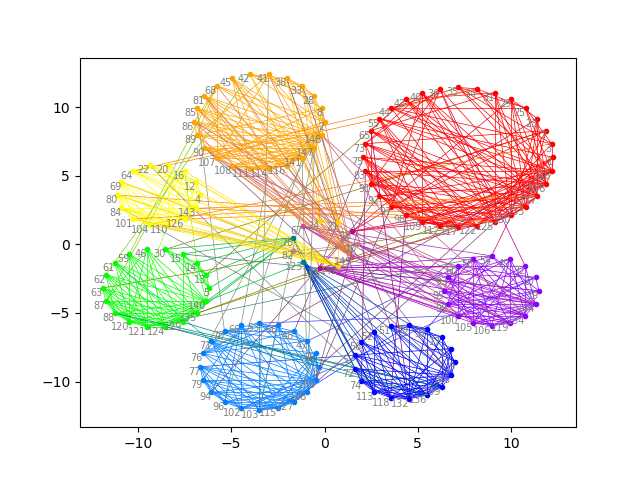

# Hierarchical Clustering
[项目] 基于层次聚类算法的无向图聚类实现 Implementation of hierarchical clustering method

My implementation of clustering algorithm, written in Python:

- Base on the hierarchical clustering method, and is implemented without third part packages.
- Work well on undirected graph of at most 10k nodes, but requires further optimizations.
- Include attempts to visualize the clustering results and to analysize Chinese stock market.

项目组成部分：

- 数据生成器benchmark
- 无向图层次聚类算法的实现
- 聚类结果可视化
- 附带一个应用于沪股分析的子项目

